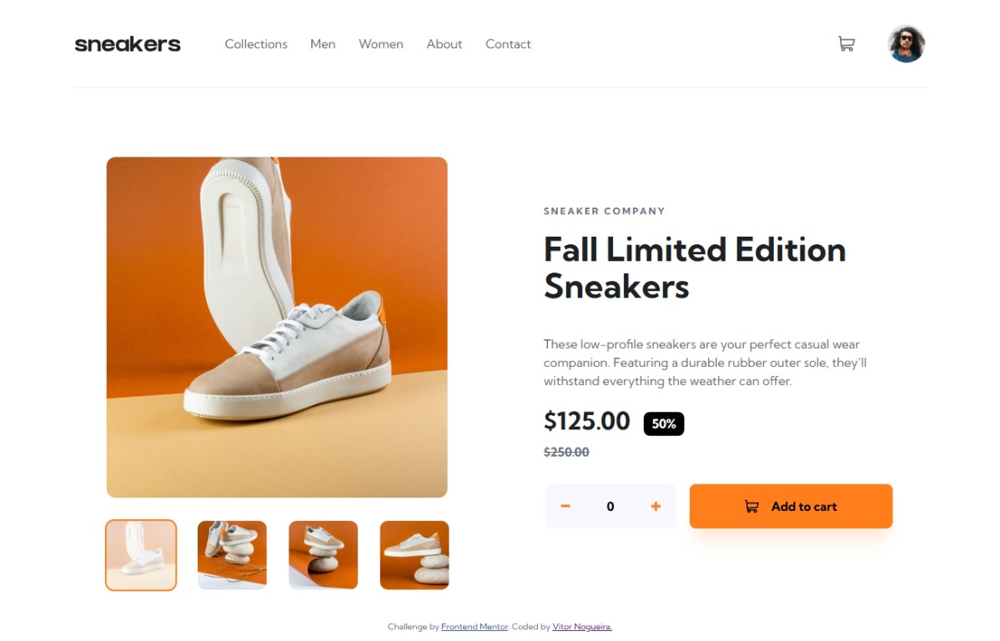

# Frontend Mentor - E-commerce product page solution

This is a solution to the [E-commerce product page challenge on Frontend Mentor](https://www.frontendmentor.io/challenges/ecommerce-product-page-UPsZ9MJp6). Frontend Mentor challenges help you improve your coding skills by building realistic projects.

## Table of contents

- [Overview](#overview)
  - [The challenge](#the-challenge)
  - [Screenshot](#screenshot)
  - [Links](#links)
- [My process](#my-process)
  - [Built with](#built-with)
  - [What I learned](#what-i-learned)
  - [AI Collaboration](#ai-collaboration)
- [Author](#author)

## Overview

### The challenge

Users should be able to:

- View the optimal layout for the site depending on their device's screen size
- See hover states for all interactive elements on the page
- Open a lightbox gallery by clicking on the large product image
- Switch the large product image by clicking on the small thumbnail images
- Add items to the cart
- View the cart and remove items from it

### Screenshot

### Links

- Solution URL: [https://github.com/VitorEmanoelNogueira/ecommerce-product-page-main](https://github.com/VitorEmanoelNogueira/ecommerce-product-page-main)
- Live Site URL: [https://vitoremanoelnogueira.github.io/ecommerce-product-page-main/](https://vitoremanoelnogueira.github.io/ecommerce-product-page-main/)

## My process

### Built with

- Semantic HTML5 markup;
- Web accessibility (WCAG, ARIA, and assistive technology testing);
- BEM, namespaces and SMACSS;
- Sass/SCSS;
- CSS custom properties;
- Flexbox;
- CSS Grid;
- Modular JavaScript (ES modules);
- Mobile-first workflow.

### What I learned

- How to implemment an accessible image carousel,
- How the ``popover` attribute can be used with aria-haspopup for components like the shopping cart, where it can be a better fit than a `<dialog>` element or `role="dialog"`;
- How reading layout properties such as `element.offsetWidth` can force the browser to calculate layout synchronously, which can be useful for coordinating CSS transitions.

### AI Collaboration

I used ChatGPT to help me analyze and structure how I would approach building the project, understand new concepts, debug issues, and to refactor code. Some of its suggestions worked very well, while others were not suitable for the context and required further evaluation or adjustment.

## Author

- Frontend Mentor - [@VitorEmanoelNogueira](https://www.frontendmentor.io/profile/VitorEmanoelNogueira)
